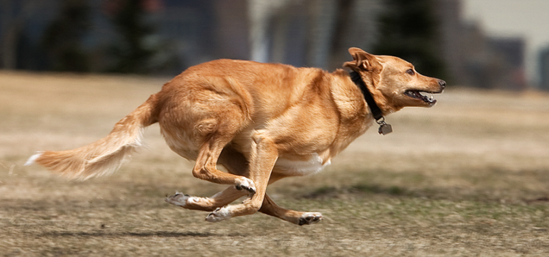

# 멀티모달 임베딩 모델

## 1. CLIP

#### 모달리티 (Modality)
- **모달리티**: 정보가 입력되는 방식 또는 형태를 의미. 
    - 예를 들어, 텍스트/이미지/음성/비디오 등이 각기 다른 모달리티에 해당.
- **멀티모달(Multimodal)**: 여러 모달리티를 동시에 처리하는 것을 의미

#### CLIP


- **CLIP** : Contrastive Language–Image Pretraining
- 이미지와 텍스트 쌍을 기반으로 임베딩 모델을 학습하여, 두 모달리티가 하나의 벡터 공간에 임베딩 되도록 함.
  - 이미지와 텍스트에서 각각 임베딩을 만들어 서로 비교할 수 있음.

- **CLIP의 예시**:
  - 고양이 이미지와 3개의 텍스트 "A cat", "A dog", "A nuclear submarine"이 있을 때, 고양이 이미지의 임베딩 벡터는 "A cat"의 임베딩 벡터와 가까운 위치로 임베딩된다.

 <br/>


```python
import torch
from transformers import CLIPProcessor, CLIPModel
from PIL import Image
import os
import numpy as np

# 코사인 유사도 계산 
def cosine_similarity(vec1, vec2):
    dot_product = np.dot(vec1, vec2)
    norm_vec1 = np.linalg.norm(vec1)
    norm_vec2 = np.linalg.norm(vec2)
    return dot_product / (norm_vec1 * norm_vec2)

# CLIP 모델 불러오기
model = CLIPModel.from_pretrained("openai/clip-vit-base-patch32")
processor = CLIPProcessor.from_pretrained("openai/clip-vit-base-patch32")

# 이미지 불러오기
image = Image.open('./cat.jpg')

# 이미지 임베딩하기
image_inputs = processor(images=image, return_tensors="pt", padding=True)
with torch.no_grad():
    image_embedding = model.get_image_features(**image_inputs)

# 텍스트 정의
texts = ['A dog', 'A cat', 'A nuclear submarine']

# 각 텍스트 임베딩하기
text_inputs = processor(text=texts, return_tensors="pt", padding=True)
with torch.no_grad():
    text_embedding = model.get_text_features(**text_inputs)

# 각 텍스트의 코사인 유사도 계산
print('=======================================')
for i in range(len(texts)):
    similarity = cosine_similarity(image_embedding[0], text_embedding[i])
    print(texts[i], ' : ', similarity)
print('=======================================')

```

## 2. Top-K 검색

#### 여러 임베딩 벡터 사이 간의 유사도 계산

- `torch.nn.functional.cosine_similarity`는 여러 벡터 간의 코사인 유사도를 계산할 수 있는 함수.
    - 처리해야 하는 임베딩 벡터가 많을 때 유용하게 사용.
    - `for`을 사용하지 않아도 여러 벡터의 코사인 유사도를 한번에 계산할 수 있음.

- `N개의 D차원`의 벡터와 `M개의 D차원`의 벡터 사이의 코사인 유사도를 계산.
    - `N개의 D차원`은 `(N, D)`의 모양을 가짐.
    - `M개의 D차원`은 `(M, D)`의 모양을 가짐.
    - 코사인 유사도 결과는 `(N, M)`의 모양을 가짐.

- 아래의 예제 코드에서 `cosine_similarity`의 모양과 값을 생각해보시오.

<!-- vec1 shape = (1, 3) / vec2 shape = (1, 3) -->
```python
import torch
import torch.nn.functional as F

# Example 1
vec1 = torch.tensor([[1, 2, 3]])
vec2 = torch.tensor([[4, 5, 6]])
cosine_similarity = F.cosine_similarity(vec1, vec2)
print("Cosine similarity (1, 3) vs (1, 3):", cosine_similarity)
```
<!-- vec1 shape = (1, 3) / vec2 shape = (4, 3) -->
```python
import torch
import torch.nn.functional as F

# Example 2
vec1 = torch.tensor([[1, 2, 3]])
vec2 = torch.tensor([[4, 5, 6], [1, 0, -1], [0, 1, 1], [-1, -2, -3]])
cosine_similarity = F.cosine_similarity(vec1, vec2)
print("Cosine similarity (1, 3) vs (4, 3):", cosine_similarity)
```

<!-- vec 1 shape = (2, 3) / vec2 shape = (4, 3) -->
```python
import torch
import torch.nn.functional as F

# Example 3
vec1 = torch.tensor([[1, 2, 3], [4, 0, -4]])
vec2 = torch.tensor([[4, 5, 6], [1, 0, -1], [0, 1, 1], [-1, -2, -3]])
cosine_similarity = F.cosine_similarity(vec1.unsqueeze(1), vec2, dim=2)
print("Cosine similarity (2, 3) vs (4, 3):\n", cosine_similarity)

```

#### Top-K 검색
- **Top-K 검색**: 특정 기준에 따라 가장 관련성 높은 K개의 항목을 찾아 반환하는 방식.
    - Top-1: 가장 유사한 검색 결과 반환.
    - Top-3: 가장 유사한 검색 결과 3개 반환.
- **argmax**: 최대값의 **인덱스**를 반환하는 함수.
    - 주어진 벡터에서 가장 큰 값의 **위치**를 찾는 데 사용.
    - `[-2, 1, 99, 8].argmax()`의 결과는 `2`
    - `[-2, 1, 99, 8].argmax().item()`의 결과는 `99`
    - Top-1의 검색 결과를 찾기 위해서 사용
- **top-k**: K번째 최대값까지의 **인덱스**들을 반환하는 함수.

```python
import torch
from transformers import CLIPProcessor, CLIPModel
from PIL import Image
from torch.nn.functional import cosine_similarity
import os
import numpy as np

# CLIP 모델 불러오기
model = CLIPModel.from_pretrained("openai/clip-vit-base-patch32")
processor = CLIPProcessor.from_pretrained("openai/clip-vit-base-patch32")

# 이미지 불러오기
images = []
image_filenames = []
for i in range(9):
    image_filenames.append('./topk-image/dog_'+str(i)+'.png')
    images.append(Image.open(image_filenames[i]))

# 이미지 임베딩
image_inputs = processor(images=images, return_tensors="pt", padding=True)
with torch.no_grad():
    image_embeddings = model.get_image_features(**image_inputs)

# 텍스트
text = ['A dog is sleeping']
text_inputs = processor(text=text, return_tensors="pt", padding=True)
with torch.no_grad():
    text_embedding = model.get_text_features(**text_inputs)

# 코사인 유사도
similarities = cosine_similarity(text_embedding, image_embeddings)

# TOP-K 결과 찾기
k = 3
top_3_indices = similarities.topk(k).indices
print("Top 3 most similar images:")
for idx in top_3_indices:
    print(f"- {image_filenames[idx]}")
```

## 퀴즈 1: 코사인 유사도
- 아래의 두 벡터 `vec1`, `vec2` 사이의 코사인 유사도를 구했을 때의 결과를 계산하시오.

- `vec1 = [[1, 2, 3, 4], [5, 6, 7, 8]]`
- `vec2 = [[0.1, 0.01, 2, 5], [1, 5, 10, 5]]`

## 퀴즈 2: 달리는 강아지 사진 검출하기
- Top-K 결과를 반환하는 코드에서 `text`를 바꾸어서 아래 결과들이 나올 수 있도록 하시오.

  - 
  - 
  - 

## 퀴즈 3: 이미지 불러오기
- `quiz_search.py`코드에서 이미지를 불러오는 코드를 작성하시오.
- `Total 200 images are loaded!`가 출력되어야 통과.

## 퀴즈 4: 이미지 임베딩 하기
- `quiz_search.py`코드에서 이미지 200개를 임베딩하여 하나의 변수 `image_embeddings`에 저장하는 코드를 작성하시오.
- `Image Embedding's shape: (200, 512)`가 출력되어야 통과.

## 퀴즈 5: 텍스트 임베딩 하기
- `quiz_search.py`코드에서 주어진 텍스트를 임베딩하여 변수 `text_embedding`에 저장하는 코드를 작성하시오.
- `Text Embedding's shape: (1, 512)`가 출력되어야 통과.

## 퀴즈 6: 검색 결과 출력하기
- `quiz_search.py`코드에서 Top-1 검색 결과를 출력하는 코드를 작성하시오.
- 힌트: `argmax().item()`함수와 `image_filenames` 변수를 적절히 활용

## 퀴즈 7: 검색 텍스트 추론하기
- 다음 5가지 그림을 찾아낼 수 있는 텍스트를 찾아보시오.


