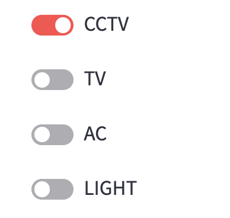
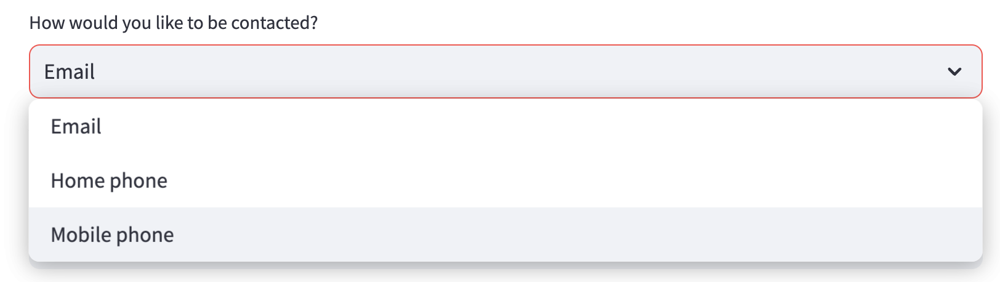
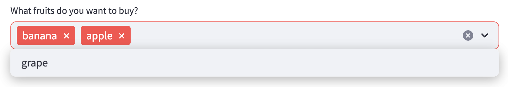
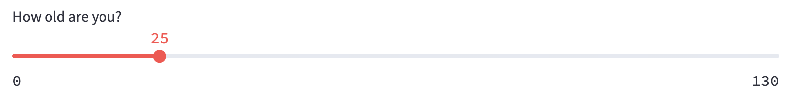
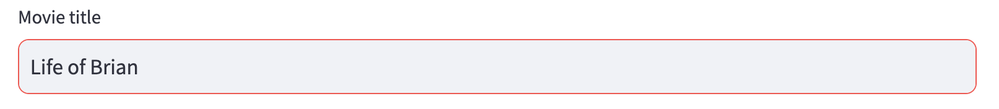
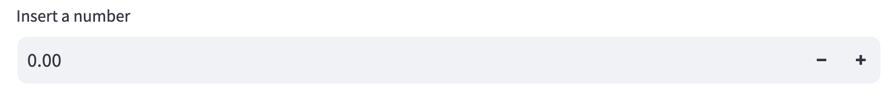

# Streamlit - 입력 UI

## UI
- **UI(User Interface)**: 사용자가 프로그램과 상호작용할 수 있도록 설계된 화면 및 요소.
- **UI가 필요한 이유**: 사용자가 쉽게 데이터를 입력하고 결과를 확인할 수 있도록 도와준다.

## 와이어프레임
- **와이어프레임**: UI의 기본적인 레이아웃을 구성하는 스케치.
- **와이어프레임이 필요한 이유**: UI 설계 시, 사용자 경험을 고려하여 효과적인 배치를 계획할 수 있다.

## Streamlit 실행
1. 내가 기억할 수 있는 위치에 `UI.py` 파일을 만든다.
2. 아래와 같이 코드를 입력한다.
    ```python
    import streamlit as st
    st.title('Input UI')
    ```
    - `streamlit`을 가져와 UI를 만들 수 있도록 설정.
    - `st.title()`함수를 통해서 제목을 만들 수 있다.
3. Miniconda 명령 프롬프트를 코드가 있는 위치에서 실행한다.
4. Miniconda 명령 프롬프트에 다음과 같이 입력하여 프로그램을 실행한다.
    ```bash
    streamlit run UI.py
    ```

## Streamlit 입력 UI - 단계별 설명

### 기본 설정
```python
import streamlit as st
```
- `streamlit`을 가져와 UI를 만들 수 있도록 설정.
### Title
```python
st.title('Input UI')
```
- 애플리케이션의 제목을 설정하는 코드.

### Button
  

```python
st.button("Reset", type="primary")
```
- 버튼을 추가하며, `type="primary"` 옵션을 사용해 강조된 버튼 스타일을 적용.

```python
if st.button('Plus', type='primary'):
    st.write(10)
else:
    st.write(0)
```
- 버튼을 클릭하면 10을 출력하고, 클릭하지 않으면 0을 출력.

### Checkbox

  

```python
agree = st.checkbox('I agree')
if agree:
    st.write('Great!')
```
- 사용자가 체크박스를 선택하면 `Great!`이라는 메시지를 출력.

### Toggle

  

```python
cctv = st.toggle('CCTV')
tv = st.toggle('TV')
ac = st.toggle('AC')
light = st.toggle('LIGHT')
```
- 여러 개의 토글 스위치를 추가하여 선택 가능하게 함.

```python
st.write('Switch ON: ')
if cctv:
    st.write('CCTV is on')
if tv:
    st.write('TV is on')
if ac:
    st.write('AC is on')
if light:
    st.write('LIGHT is on')
```
- 선택된 토글 스위치에 대한 메시지를 출력.

### Selectbox

  

```python
option = st.selectbox(
    'How would you like to be contacted?',
    ['Email', 'Home phone', 'Mobile phone']
)
st.write('You selected:', option)
```
- 드롭다운 리스트에서 하나의 옵션을 선택할 수 있도록 함.

### Multiselect

  

```python
price = {
    'apple': 30,
    'banana': 20,
    'grape': 50
}
options = st.multiselect(
    'What fruits do you want to buy?',
    ['apple', 'banana', 'grape'],
)
```
- 여러 개의 아이템을 선택할 수 있도록 다중 선택 UI 추가.

```python
total = 0
for fruit in options:
    total += price[fruit]
st.write('Price: ', total)
```
- 선택한 과일들의 총 가격을 계산하여 출력.

### Slider

  

```python
age = st.slider('How old are you?', 0, 130, 25)
st.write("I'm ", age, 'years old')
```
- 슬라이더를 사용하여 숫자를 조절할 수 있도록 함.

### Text Input

  

```python
title = st.text_input('Movie title', 'Life of Brian')
st.write('The current movie title is', title)
```
- 사용자가 입력한 텍스트를 출력.

### Number Input


  

```python
number = st.number_input('Insert a number')
st.write('The current number is ', number)
```
- 숫자를 입력받아 출력하는 UI.

