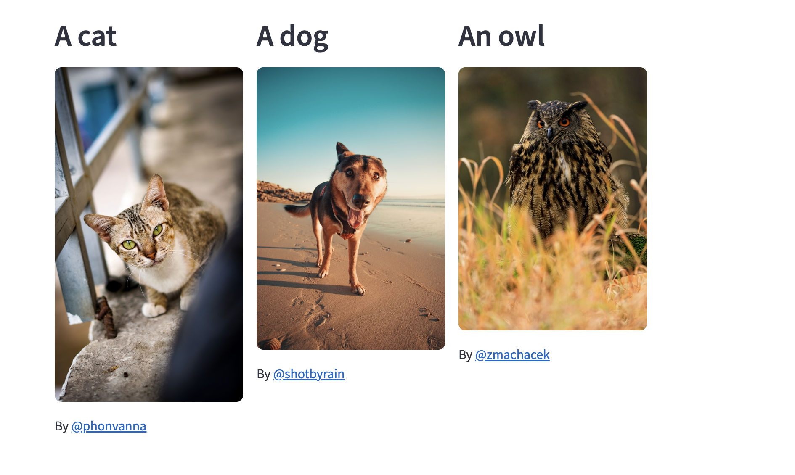
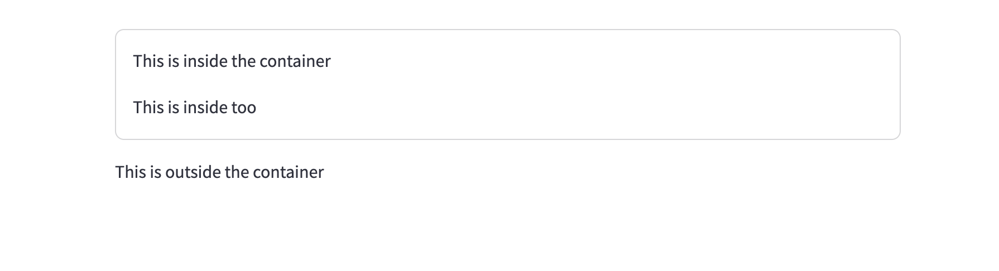
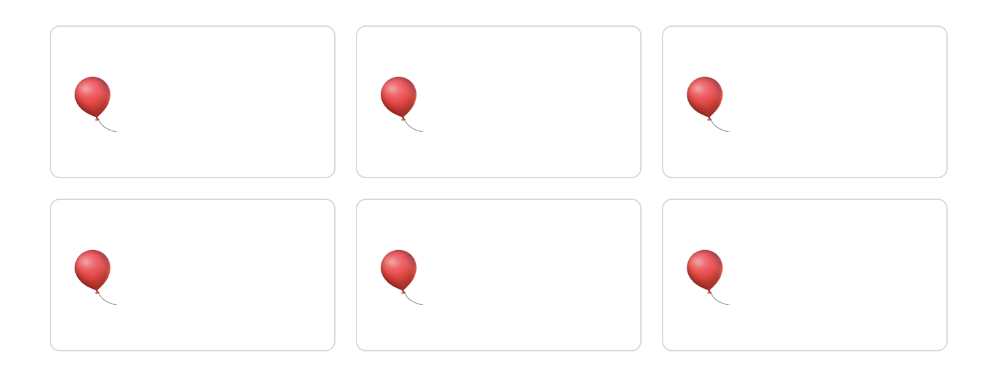
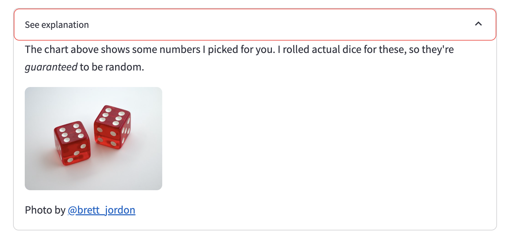
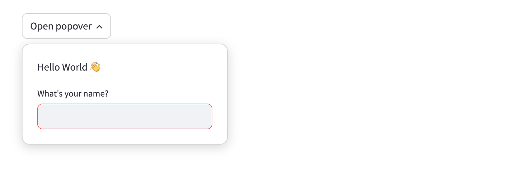
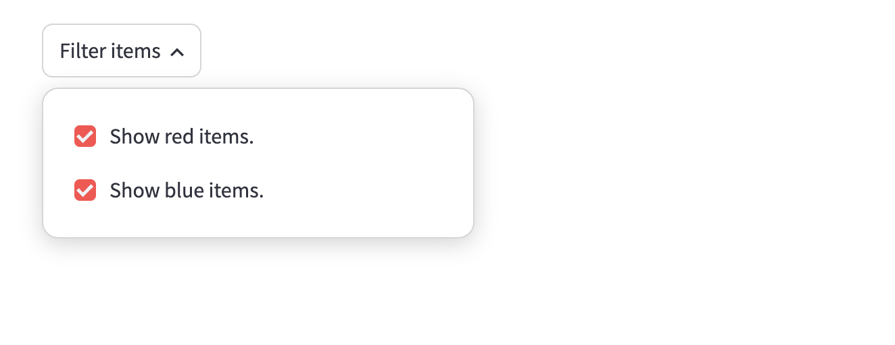
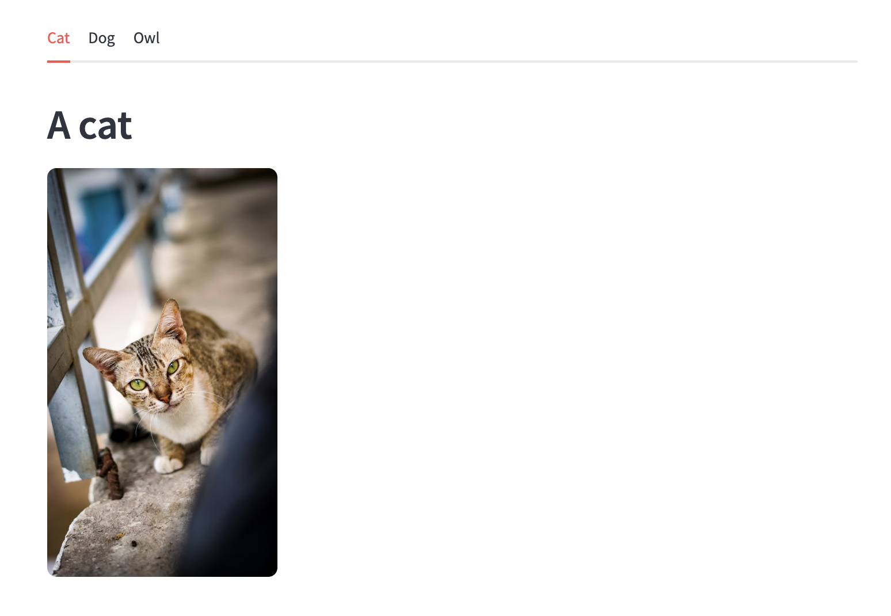
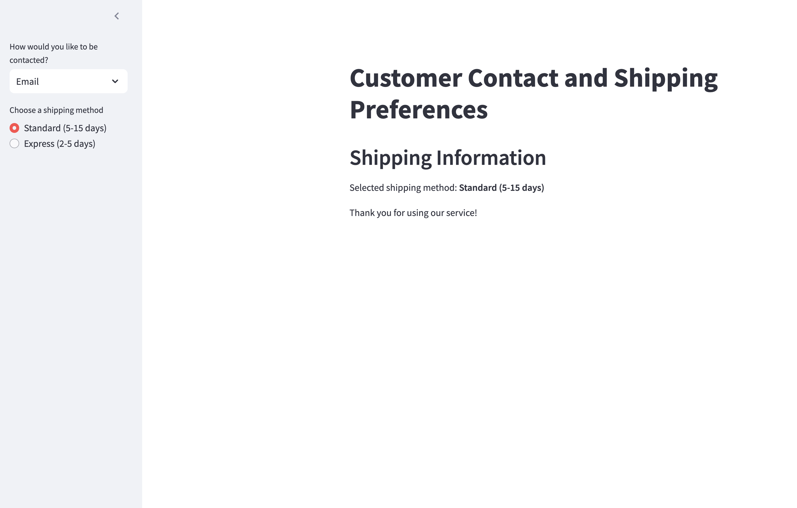

# Streamlit - Layout

## Layout이란
- **Layout(레이아웃)**: 화면에서 콘텐츠/UI를 어떻게 **배치**할지를 결정하는 구조적인 설계.
- Streamlit에서는 여러 가지 레이아웃 기능을 제공하여 UI를 보다 직관적으로 구성할 수 있다.

## Streamlit Layout

### Columns
여러 개의 열을 만들어 화면을 나누는 데 사용된다.


```python
import streamlit as st

col1, col2, col3 = st.columns(3)

with col1:
    st.header("A cat")
    st.image("https://static.streamlit.io/examples/cat.jpg") 

with col2:
    st.header("A dog")
    st.image("https://static.streamlit.io/examples/dog.jpg")

with col3:
    st.header("An owl")
    st.image("https://static.streamlit.io/examples/owl.jpg")
```

### Container (컨테이너)
컨테이너를 사용하면 그룹화된 콘텐츠를 쉽게 구성할 수 있다.


```python
import streamlit as st

container = st.container(border=True)
container.write("This is inside the container")
st.write("This is outside the container")

# Now insert some more in the container
container.write("This is inside too")
```

Column으로 만든 각각의 칸들을 Container로 씌울 수도 있다.


```python
import streamlit as st

row1 = st.columns(3)
row2 = st.columns(3)

for col in row1 + row2:
    tile = col.container(height=120)
    tile.title(":balloon:")
```

### Expander
사용자가 클릭하여 내용을 펼쳐볼 수 있도록 하는 UI 요소.


```python
import streamlit as st

with st.expander("See explanation"):
    st.write('''
        The chart above shows some numbers I picked for you.
        I rolled actual dice for these, so they're *guaranteed* to
        be random.
    ''')
    st.image("https://static.streamlit.io/examples/dice.jpg")
```

### Pop Over
특정 버튼을 클릭하면 나타나는 팝업 UI 요소.


```python
import streamlit as st

with st.popover("Open popover"):
    st.markdown("Hello World 👋")
    name = st.text_input("What's your name?")

st.write("Your name:", name)
```


```python
import streamlit as st

popover = st.popover("Filter items")
red = popover.checkbox("Show red items.", True)
blue = popover.checkbox("Show blue items.", True)

if red:
    st.write(":red[This is a red item.]")
if blue:
    st.write(":blue[This is a blue item.]")
```

### Tabs
여러 개의 탭을 사용하여 UI를 나눌 수 있다.


```python
import streamlit as st

tab1, tab2, tab3 = st.tabs(["Cat", "Dog", "Owl"])

with tab1:
    st.header("A cat")
    st.image("https://static.streamlit.io/examples/cat.jpg", width=200)
with tab2:
    st.header("A dog")
    st.image("https://static.streamlit.io/examples/dog.jpg", width=200)
with tab3:
    st.header("An owl")
    st.image("https://static.streamlit.io/examples/owl.jpg", width=200)
```

### Side Bar
화면 왼쪽에 별도의 사이드바를 만들어 UI 요소를 배치할 수 있다.


```python
import streamlit as st

# Sidebar with a selectbox and radio button
add_selectbox = st.sidebar.selectbox(
    "How would you like to be contacted?",
    ("Email", "Home phone", "Mobile phone")
)

with st.sidebar:
    add_radio = st.radio(
        "Choose a shipping method",
        ("Standard (5-15 days)", "Express (2-5 days)")
    )

# Main content area
st.title("Customer Contact and Shipping Preferences")

st.header("Shipping Information")
st.write(f"Selected shipping method: **{add_radio}**")
st.write("Thank you for using our service!")
```
