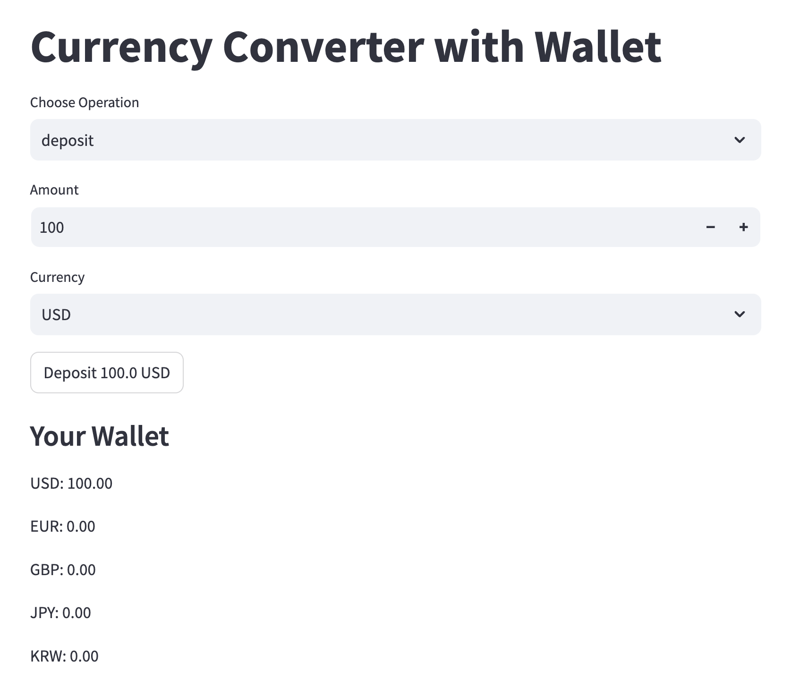
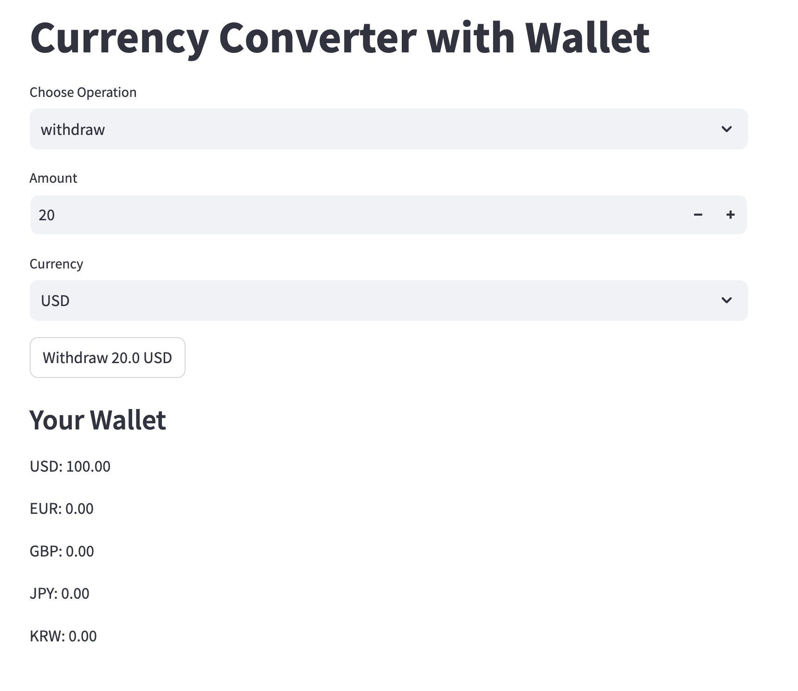
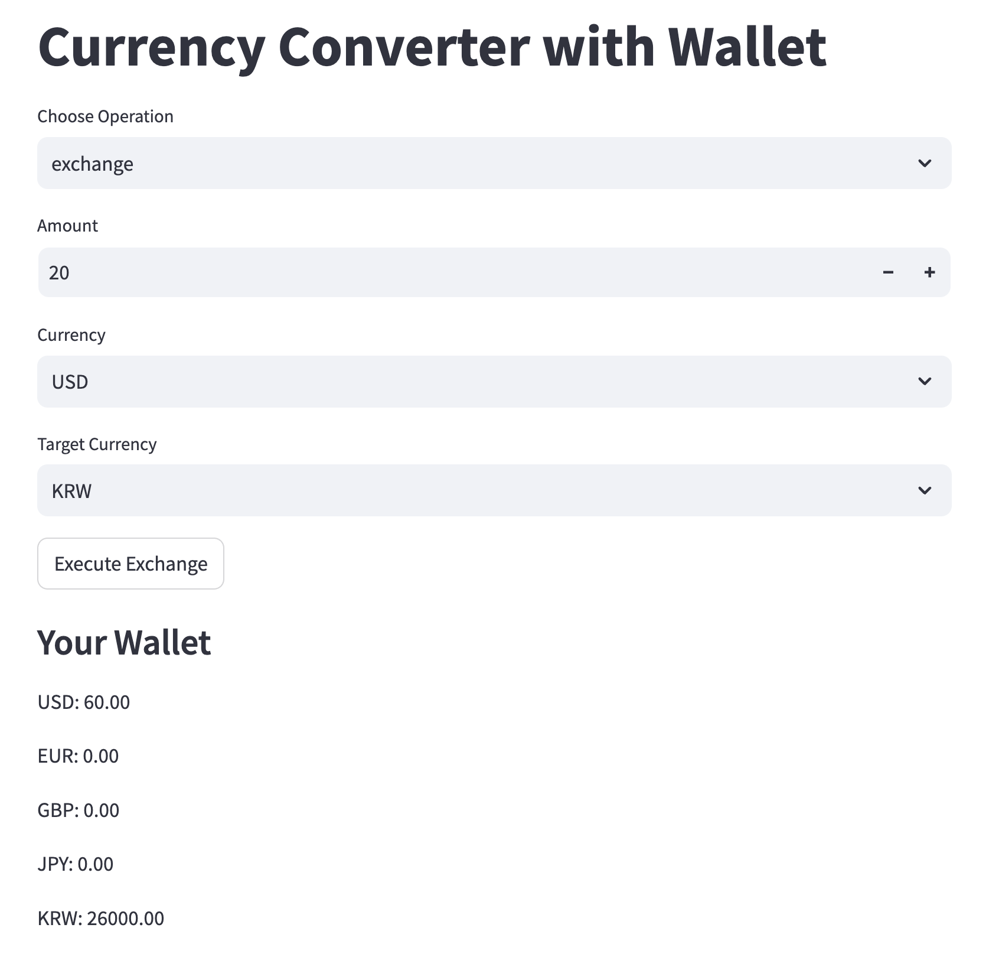

# Streamlit - Session State

## Streamlit 작동방식
- Streamlit은 사용자가 입력을 넣을 때마다 **전체 코드가 다시 실행**된다.
- 따라서, 일반적인 변수는 매번 초기화되기 때문에 값을 유지할 수 없다.
- 이러한 문제를 해결하기 위해 **Session State**를 사용해야 한다.

## Session State 없이 변수 관리하기
```python
import streamlit as st

st.title("Counter without Session State")

count = 0  # 매번 실행될 때마다 count가 초기화됨
if st.button("Increase"):
    count += 10
st.write("Count:", count)
```
### 문제 원인
- 사용자가 `Increase` 버튼을 누르면 `count`가 10 증가해야 하지만, 매번 코드가 다시 실행될 때 `count`가 0으로 초기화된다.
- 따라서 버튼을 눌러도 값이 유지되지 않고 항상 10이 출력된다.

## Session State를 사용한 변수 관리
```python
import streamlit as st

st.title("Counter with Session State")

# count 변수를 session_state로 만들기
if "count" not in st.session_state:
    st.session_state.count = 0  

if st.button("Increase"):
    st.session_state.count += 10  # session_state를 변수처럼 취급

st.write("Count:", st.session_state.count)
```
### 해결 방법
- `st.session_state.count`를 사용하여 값이 유지되도록 설정.
- `if "count" not in st.session_state:`를 통해 처음 실행될 때만 초기화.
- `st.session_state.count`를 업데이트하면 버튼을 누를 때마다 값이 유지되며 증가한다.

## Session State 활용 예시
- 사용자의 로그인 상태 유지
- 다중 스텝 폼에서 데이터 저장
- 슬라이더 값 변경을 저장하여 연속적인 조작 가능

## Practice - Wallet
> Streamlit을 사용하여 **지갑(Wallet)** 앱을 완성한다.
> 이 앱은 사용자가 다양한 통화를 **입금(Deposit), 출금(Withdraw), 환전(Exchange)**할 수 있도록 하며, 지갑 잔액을 지속적으로 관리할 수 있도록 한다.
### 기능 1: 입금 (Deposit)


- 사용자가 'deposit'을 선택했을 때, 버튼을 누르면 `Amount만큼 Currency증가`

### 기능 2: 출금 (Withdraw)

- 사용자가 'withdraw'을 선택했을 때, 버튼을 누르면 `Amount만큼 Currency감소`
- **예외 처리에 대해 생각할 것.**

### 기능 3: 환전 (Exchange)

- 사용자가 'exchange'을 선택했을 때, 버튼을 누르면 `Amount만큼 Currency감소 Target Currency는 환율만큼 계산된 뒤 증가`
- **예외 처리에 대해 생각할 것.**


