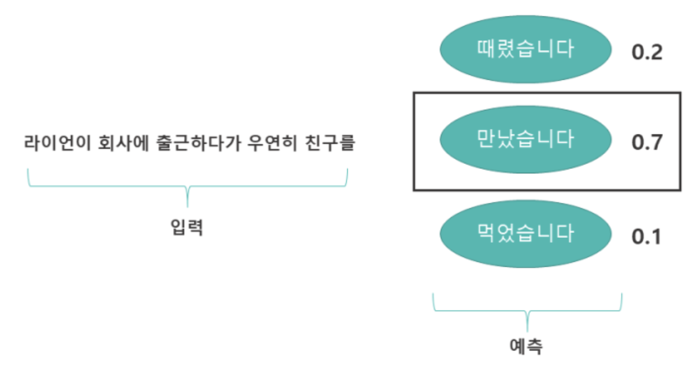
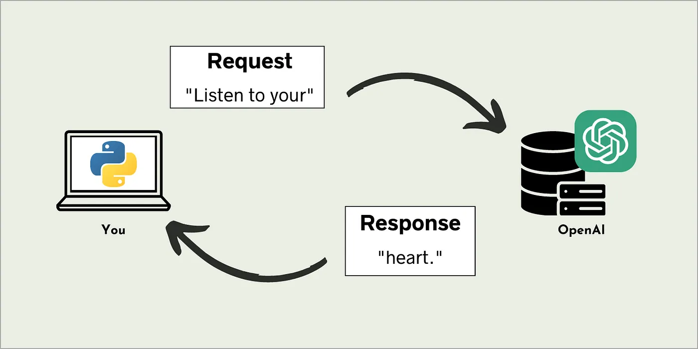
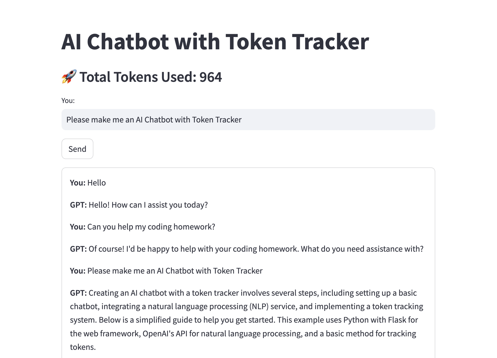

# OpenAI API

## OpenAI
- **OpenAI**: 인공지능 연구 및 개발을 하는 회사로, 다양한 AI 모델을 개발하여 API 형태로 제공.
- **OpenAI API**:
  - **GPT**: 텍스트 생성 및 이해를 위한 AI 모델.
  - **DALL·E**: 이미지 생성 AI 모델.
  - **Whisper**: 음성 인식 AI 모델.
  - **Embeddings**: 문장을 벡터로 변환하여 검색, 추천, 의미 분석에 활용할 수 있는 API.

## Large Language Model (LLM)


- **LLM (Large Language Model)**: 대규모 텍스트 데이터를 학습하여 입력받은 텍스트(프롬프트)를 기반으로 다음에 올 가능성이 높은 토큰을 예측하며 문장을 생성하고 이해하는 AI 모델.
- **프롬프트 (Prompt)**: LLM의 입력 텍스트로, 모델이 어떤 내용을 생성할지 결정하는 역할.
- **토큰 (Token)**: 
  - LLM은 문장을 단어 단위가 아닌 **토큰(Token)** 단위로 처리한다.
  - 토큰은 하나의 단어나 글자의 일부일 수 있으며, 영어에서는 단어 하나가 하나의 토큰이 될 수 있지만, 한국어에서는 한 글자가 하나의 토큰이 될 수도 있음.
  - 예를 들어 `Hello, world!`라는 문장은 **3개의 토큰**으로 분리될 수 있음: `Hello`, `,`, `world!`.
  - 모델이 한 번에 처리할 수 있는 최대 토큰 수가 제한되어 있음 (예: GPT-4o는 약 128k 토큰 지원).

## Messages

- OpenAI LLM을 사용할 때는 **여러 개의 메시지를 입력한 후 다음 메시지를 생성**하는 방식.
- **Role**: 각 메시지는 **역할**과 함께 작성한다.
  - **Developer (개발자)**: AI에게 특정한 행동 방식을 지시하는 메시지.
    - 예제: `You are a helpful assistant that answers programming questions in the style of a southern belle from the southeast United States.`
  - **User (사용자)**: 사람이 AI에게 보내는 메시지.
    - 예제: `Write a poem about programming.`
  - **Assistant (도우미)**: AI가 생성하는 응답 메시지.
    - 예제: 사용자가 물어본 질문에 대한 답변을 생성함.


## GPT API



### GPT
- **GPT(Generative Pre-trained Transformer)** 는 대규모 텍스트 데이터를 학습하여 입력 프롬프트 다음에 올 가능성이 높은 단어를 예측하며 문장을 생성하는 LLM 모델이다.
  - 문장 생성뿐만 아니라 **번역, 요약, 코딩, 질의응답, 창의적 글쓰기** 등 다양한 작업을 수행할 수 있다
  - 최신 모델(2024년 출시)인 **GPT-4o**는 이전 모델보다 더 빠르고 정확한 텍스트 응답을 제공한다.
  - 더 많은 토큰을 사용할 수록 더 많은 계산 비용이 발생한다.

### GPT API 사용법

`1_openai.py` 코드를 살펴보자
```python
from openai import OpenAI
client = OpenAI(api_key=YOUR_KEY_HERE) # api_key를 꼭 입력해야 한다.

completion = client.chat.completions.create(
  model="gpt-4o",
  messages=[
    {"role": "developer", "content": "You are a helpful assistant."},
    {"role": "user", "content": "Hello!"}
  ]
)

print(completion.choices[0].message)
```

-  출력 결과
    ```
    ChatCompletionMessage(content='Hello! How can I assist you today?', role='assistant', function_call=None, tool_calls=None, refusal=None)
    ```

- **다음 메시지만 가져오고 싶을 때**:
  ```python
  print(completion.choices[0].message.content)
  ```
  ```
  Hello! How can I assist you today?
  ```
- 다음 코드를 실행해보고 결과를 해석해보자.
  ```python
  print(completion.choices[0].message.role)
  ```

- **토큰 사용량을 알고 싶을 때**:
  GPT API에서 사용한 토큰을 알 수 있다. 다음 코드를 실행해보고 각 코드의 출력 결과를 해석해보자.
  ```python
  print(completion.usage)
  print(completion.usage.completion_tokens)
  print(completion.usage.prompt_tokens)
  print(completion.usage.total_tokens)
  ```

### 예제: 챗봇 만들기

> 대화가 가능한 챗봇은 사용자와의 대화 내용을 기억하고 있어야 한다. GPT API를 통해서 챗봇을 만드려면 어떻게 해야할까?
>
> **대화 내역**을 프롬프트에 넣어주면 된다!

`2_simplechatbot.py`를 살펴보자.
```python
from openai import OpenAI

client = OpenAI(api_key=YOUR_KEY_HERE)

# 대화 내역 리스트
chat_history = [{"role": "developer", "content": "You are a helpful chat-bot."}]

while True:
    user_input = input("\nYou: ")

    if user_input.lower() in ["exit", "quit"]:
        print("대화를 종료합니다.")
        break

    # 사용자 입력 추가
    chat_history.append({"role": "user", "content": user_input})

    # OpenAI API 요청
    response = client.chat.completions.create(
        model="gpt-4o",
        messages=chat_history
    )

    # 챗봇 응답 추가 및 출력
    assistant_message = response.choices[0].message.content
    chat_history.append({"role": "assistant", "content": assistant_message})

    print("\nGPT: " + assistant_message)
```

- `chat_history`에 대화 내역을 리스트로 저장한다
  ```python
  chat_history = [{"role": "developer", "content": "You are a helpful chat-bot."}]
  ```

- 사용자가 `exit`이나 `quit`을 입력하기 전까지 프로그램을 계속 실행한다.
  ```python
  while True:
      user_input = input("\nYou: ")

      if user_input.lower() in ["exit", "quit"]:
          print("대화를 종료합니다.")
          break
  ```

- 사용자가 방금 입력한 텍스트를 `role=user`, `content=user_input`로 대화 내역에 추가한다
  ```python
    chat_history.append({"role": "user", "content": user_input})

    response = client.chat.completions.create(
        model="gpt-4o",
        messages=chat_history
    )
  ```

- GPT API의 응답을 `role=assistant`, `content=response.choices[0].message.content`로 대화 내역에 추가한다.
  ```python
    response = client.chat.completions.create(
        model="gpt-4o",
        messages=chat_history
    )

    assistant_message = response.choices[0].message.content
    chat_history.append({"role": "assistant", "content": assistant_message})
  ```

### 퀴즈: 챗봇 GUI 만들기


`3_quiz.py`의 TODO를 채워서 챗봇 GUI를 만들어보자

다음 기능이 모두 동작해야 한다
- Text Input에 입력을 한 뒤에 Send 버튼을 누르면 GPT API가 사용자 입력에 대한 응답을 한다
- 사용자의 대화 내역을 저장해서 챗봇이 이전 대화 내용을 기억할 수 있어야 한다
- GPT에서 사용한 토큰의 수를 누적하여 Total Tokens Used 옆에 보여준다