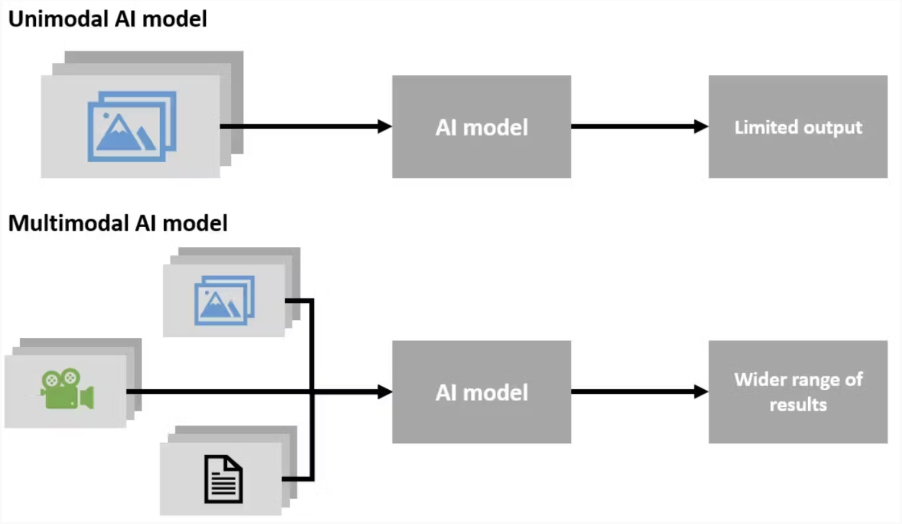
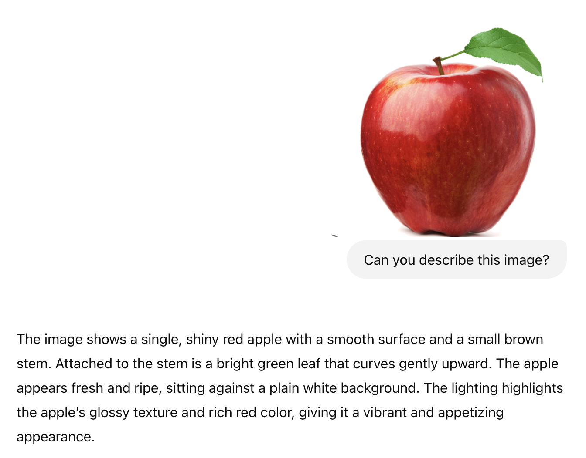

# GPT API - Multimodal 

## Modality



- **모달리티(Modality)**: 정보가 입력되는 방식 또는 형태를 의미. 
    - 텍스트/이미지/음성/비디오
    - 예) Whisper 모델은 음성 모달리티를 처리한다.
- **멀티모달(Multimodal)**: 여러 모달리티를 동시에 처리하는 것을 의미
  - 여러 모달리티를 동시에 처리할 수 있는 AI 모델을 멀티모달 모델이라고 부른다. 
  - GPT는 멀티모달 모델이다.

## Multimodal GPT



> GPT는 이미지를 처리할 수 있다. GPT는 멀티모달 모델이기 때문이다. <br/>
> 그렇다면 GPT API에서는 이미지를 어떻게 전달할 수 있을까?

### 복습
```python
from openai import OpenAI
client = OpenAI(api_key=YOUR_KEY_HERE)

completion = client.chat.completions.create(
  model="gpt-4o",
  messages=[
    {"role": "developer", "content": "You are a helpful assistant."},
    {"role": "user", "content": "Hello!"}
  ]
)

print(completion.choices[0].message)
```
- GPT API를 사용하기 위해서는 Messages를 보내줘야 한다. 이미지 또한 Messages에 포함하여 전달해야 한다.
> 이미지를 string으로 변환할 수 있을까?

### Base64

`apple.png`를 다운 받은 뒤, `1_base64.py`를 실행해보자.
```python
import base64

# 이미지 파일을 base64 문자열로 인코딩
with open("./image/apple.png", "rb") as image_file:
    base64_image = base64.b64encode(image_file.read()).decode("utf-8")

print(base64_image)  # 문자열의 앞부분만 출력
```

- **인코딩 (Encoding)**: 데이터를 특정 형식으로 변환하는 것. (예: 이미지 → 문자열)
- **Base64**: 이진법 데이터를 텍스트 형태(문자열)로 인코딩하는 방식. 이미지를 텍스트로 바꿀 때 많이 사용됨.
  - 이미지 파일을 Base64로 변환하면 텍스트로 표현된 이미지가 된다.
  - 이 텍스트를 GPT API에 메시지로 포함할 수 있다.

### GPT with image input
`2_gptimage.py`를 실행해보자.
```python
import base64
from openai import OpenAI

client = OpenAI(api_key=YOUR_KEY_HERE)

# Load and encode the image
image_path = './data/apple.png'
with open(image_path, 'rb') as image_file:
    base64_image = base64.b64encode(image_file.read()).decode('utf-8')

# Prepare the image content for the message
image_message = {
    "type": "image_url",
    "image_url": {
        "url": f"data:image/png;base64,{base64_image}"
    }
}

completion = client.chat.completions.create(
    model="gpt-4o",
    messages=[
        {
            "role": "user",
            "content": [
                {"type": "text", "text": "Describe this image."},
                image_message
            ]
        }
    ]
)

print(completion.choices[0].message.content)
```

## 퀴즈: 일본 여행 가이드 AI
사용자는 지금 일본 여행중이다. 사용자는 일본 여행을 하며 맛있는 간식도 먹고 신기한 문화도 많이 접했지만, 가이드가 없어 정작 자신이 먹고 본 것이 무엇인지 알지 못한다. Multimodal GPT를 통해서 사용자가 찍은 사진에 대해 설명해주는 AI를 만들어보자.

`2_gptimage.py`를 통해 `data/1.png`, `data/2.png`, `data/3.png`, `data/4.png`에서 사용자가 궁금해하는 것을 설명해주는 가이드를 만들어보자.

<p align="center">
  
  
  
  
</p>

- 1번 사진: 식당 입구에서 찍었다. 문 위에 장식이 뭔지 알고 싶다.
- 2번 사진: 시장에서 찍었다. 이 가게가 무슨 가게인지 알고 싶다.
- 3번 사진: 편의점에서 샀는데, 뭘 먹은건지 모르겠다.
- 4번 사진: 편의점에서 샀는데, 뭘 마신건지 모르겠다.