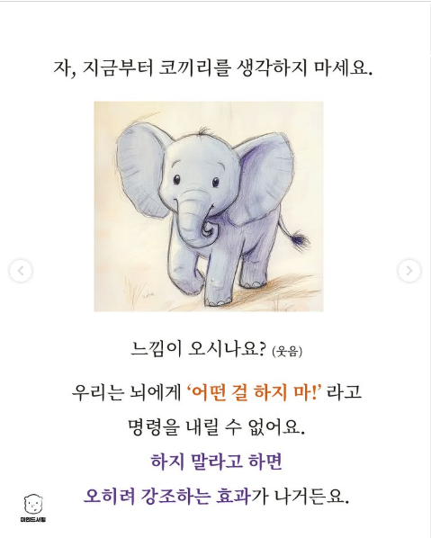

# Prompting Engineering Basics

## Prompting
- **LLM (Large Language Model)**: 대규모 텍스트 데이터를 학습해 문장을 이해하고 생성할 수 있는 인공지능 모델.
- **프롬프팅(Prompting)**: LLM에게 원하는 작업을 하도록 **프롬프트(= 입력 텍스트)** 를 작성하는 기술. 
  - LLM은 우리가 작성한 프롬프트를 기반으로 다음에 올 텍스트를 예측하며 응답을 생성한다.
- 프롬프트는 명확할수록 원하는 결과를 얻을 수 있다.

#### 예시
스타트업이 신제품을 홍보하기 위한 SNS용 글을 작성하려고 한다.

**Bad Prompt**
```
SNS 글 써줘.
```

**Good Prompt**
```
20대 여성 소비자를 타겟으로 한 화장품 브랜드의 인스타그램 홍보글을 써줘. 트렌디하고 감성적인 톤으로, 주요 특징은 ‘비건 제품, 자연 유래 성분, 피부 진정 효과’야. 해시태그도 포함해줘.
```


## 프롬프트 구성 요소
- 아래 네 가지 구성 요소가 프롬프트에 모두 필요한 것은 아니며 형식은 어떤 작업인지에 따라 달라질 수 있다.
1. **Context (문맥)**: 작업을 수행하기 위한 배경 지식이나 참고 정보.
2. **Instruction (지시)**: 모델에게 어떤 작업을 수행할지 지시.
3. **Input (입력)**: 사용자가 제공한 데이터 (예: 문장, 질문 등).
4. **Output (출력) 형식 명시 (선택적)**: 원하는 응답의 형태를 지정할 수 있다.

#### 예시

사용자는 현재 한국어를 공부하고 있는 미국인이다. 사용자는 처음 읽는 한국어의 정확한 뜻과 어떻게 문장을 번역해야하는지를 공부하고 싶다. 아래 두 프롬프트를 비교해보자.

**Bad Prompt**
```
Translate following sentence in English.

가장 좋아하는 음식은 무엇입니까?
```

**Good Prompt**
```
Context: I'm a student learning Korean.
Instruction: Translate following sentence in English.
Input: 나는 학생입니다.
Output: 
  Translation: I am a student
  Explanation:
    나는 (na-neun) = "I" (subject).
    나 (na) means "I"
    -는 is a subject particle, showing that "I" is the topic of the sentence.
    학생 (hak-saeng) = "student"
    입니다 (im-ni-da) = a polite ending that means "am/is/are" (copula verb).

가장 좋아하는 음식은 무엇입니까?
```

## 프롬프트 작성법

### 부정확성 피하기 (Avoid Impreciseness)
- 모호한 표현을 사용하기 보다는 명확한 표현을 사용하기

**Bad Prompt**
```
Explain the concept prompt engineering. Keep the explanation short, only a few sentences, and don't be too descriptive.
```
**Good Prompt**
```
Use 2-3 sentences to explain the concept of prompt engineering to a high school student.
```

<center></center>

### 할 것과 하지 말아야 할 것 (To do or not to do)

- 무언가를 하지 말라고 지시하는 것보다 무언가를 하라고 지시하는 것이 더욱 효과적

**Bad Prompt**
```
The following is an agent that recommends movies to a customer. DO NOT ASK FOR INTERESTS. DO NOT ASK FOR PERSONAL INFORMATION.

Customer: Please recommend a movie based on my interests.
Agent: 
```
```
Sure, I can recommend a movie based on your interests. What kind of movie would you like to watch? Do you prefer action, comedy, romance, or something else?
```

**Good Prompt**
```
The following is an agent that recommends movies to a customer. The agent is responsible to recommend a movie from the top global trending movies. It should refrain from asking users for their preferences and avoid asking for personal information. If the agent doesn't have a movie to recommend, it should respond "Sorry, couldn't find a movie to recommend today.".

Customer: Please recommend a movie based on my interests.
Agent:
```
```
Sorry, I don't have any information about your interests. However, here's a list of the top global trending movies right now: [list of movies]. I hope you find something you like!
```

## 프롬프팅 예시

#### Question Answering
```
Answer the question based on the context below. Keep the answer short and concise. Respond "Unsure about answer" if not sure about the answer.

Context: Teplizumab traces its roots to a New Jersey drug company called Ortho Pharmaceutical. There, scientists generated an early version of the antibody, dubbed OKT3. Originally sourced from mice, the molecule was able to bind to the surface of T cells and limit their cell-killing potential. In 1986, it was approved to help prevent organ rejection after kidney transplants, making it the first therapeutic antibody allowed for human use.

Question: What was OKT3 originally sourced from?

Answer:
```

#### Text Classification
```
Classify the text into neutral, negative or positive. 

Text: I think the food was okay. 
Sentiment:
```

```
Classify the text into neutral, negative or positive. 

Text: I think the vacation is okay.
Sentiment: neutral 

Text: I think the food was okay. 
Sentiment:
```

> 첫번째 프롬프트와 두번째 프롬프트의 차이는 무엇일까?

#### Code Generation
```
# Ask the user for their name and say "Hello" in python
```

## 퀴즈
- `1_quiz.py`의 코드를 완성해보자.
- GPT를 활용하여 각 `shopping_story`에서 지불해야 하는 금액을 계산하는 프롬프트를 작성해보자.
- 과일들의 가격은 변수 `prices`에 있다.

- **TODO**
  - `prompt`를 수정하여 올바르게 동작할 수 있도록 하자.
  - 최종 답안은 `answer`에 업데이트한다. 
    - `answer`는 반드시 `int`여야 한다.
    - 프롬프트를 바꾸지 않고 세 가지 `shopping_story`에 대해서 전부 정답처리가 되면 성공.

- **중요 조건**
  - `shopping_story` 문자열을 직접 해독하지 말고, LLM에게 이야기 전체를 그대로 전달해서 추론하게 하자.
  - `answers`에 있는 답안을 프롬프트에 입력해서는 절대 안된다.
  - `TODO` 외의 부분은 수정하지 말 것.

- **Hint**
  - Output format을 잘 설정할 것
  - 문자열 처리 함수를 잘 활용할 것 (`find()`, `split()` 등...)
  - 타입변환 `int()`를 활용할 것
  - 풀이 방법이 굉장히 다양함.

#### Test Cases
```
용식이는 바나나를 5개를 사려다가 생각해보니 1개만 있으면 충분할 것 같아서 1개만 사고 나머지 4개는 그냥 내려두었다. 
사과는 총 10개가 있었는데 그 중에서 절반 만큼을 구매했다.
복숭아는 구매하지 않은 바나나와 사과의 개수만큼 구매했다. 
```
답: 38000

```
규리는 포도를 12송이 사려다가 너무 많을 것 같아서 3분의 2만 구매했다. 
사과는 처음에 4개를 사려고 했는데, 마침 1+1 행사가 있어 2개만 가격을 내고 4개를 가져갔다. 
수박은 너무 무거워서 안 사기로 했고, 대신 복숭아를 사과의 개수만큼 샀다.
```
답: 36000

```
지혜는 바나나를 3개, 사과를 2개, 그리고 자두를 5개 담았지만, 계산대 앞에서 자두가 너무 비싸다는 것을 깨닫고 2개만 남기고 나머지는 내려두었다. 
계산 중 점원이 배를 추천해서 배 2개를 추가했고, 바나나 가격이 10% 할인 중이라 할인된 가격으로 계산되었다.
```
답: 14700

```
철수는 귤 10개를 사기로 마음먹었지만 4개는 상한 걸 발견해서 다시 내려놓았다. 
딸기는 총 6팩 중에서 3팩만 상태가 좋아서 그것만 샀고, 복숭아는 사려던 사과의 개수와 같은 수만큼 구매했다. 
사과는 총 4개가 있었지만 철수는 그 중 1개만 골랐다. 
```
답: 32300

```
민지는 체리를 사러 갔지만 재고가 8팩밖에 없었다. 원래 10팩을 사려 했지만 8팩을 모두 구매했고, 키위는 5개를 사려고 했으나 예산이 부족해 3개만 구매했다. 
대신 파인애플 1개를 추가로 샀고, 처음에 사려던 망고는 너무 비싸 포기했다. 대신 복숭아를 망고의 개수만큼 샀다. 
```
답: 56000
