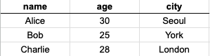

# Data File

## 데이터 포맷 종류

다양한 형태의 데이터가 존재하지만 가장 대표적으로 사용되는 데이터는 `csv`와 `json`이다.

| | CSV | JSON |
|:---|:---|:---|
| 형태 | 표(Table) 형태 | 계층(Hierarchical) 형태 |
| 설명 | 행(row)과 열(column)로 구성된 표 형식 데이터를 저장. 텍스트로 저장되며 쉼표로 구분됨. | 중첩된 구조를 가진 데이터. 키-값 쌍(key-value pairs)으로 표현되며 복잡한 관계 표현 가능. |

### CSV

- CSV: **Comma-Separated Values**의 약자로, 데이터를 쉼표(,)로 구분해 저장하는 포맷이다.
- 표 형태 데이터를 간단하게 저장하고 교환할 때 사용된다.
  - 엑셀, 스프레드시트 등의 툴을 통해서 데이터를 만들고 csv 포맷으로 저장할 수 있다.
- CSV 파일은 첫 줄에 각 열(column)의 이름이 적혀 있고, 두 번째 줄부터는 각 데이터 행(row) 이 기록된다.

#### 예시
`people.csv`를 살펴보자


```
name,age,city   ← 열 이름 (컬럼명)
Alice,30,Seoul  ← 첫 번째 데이터 행
Bob,25,New York ← 두 번째 데이터 행
Charlie,28,London ← 세 번째 데이터 행
```

### JSON

- JSON: **JavaScript Object Notation**의 약자로, 데이터를 키-값 쌍(key-value pairs) 구조로 저장하는 포맷이다.
- 트리(tree) 구조나 중첩(nested) 구조를 자연스럽게 표현할 수 있다.
  - json 데이터는 `dictionary` 타입으로 저장할 수 있다.
- 주로 복잡한 형태의 데이터를 저장할 때 사용한다.
- JSON 파일은 `{}` 안에 `"key": value` 쌍으로 데이터를 저장하고, 필요한 경우 값 안에 또 다른 `{}`를 중첩시켜 복잡한 관계를 표현할 수 있다.

#### 예시
`people.json`을 살펴보자. 과연 이 데이터를 표 형태로 정리할 수 있을까?
```
[
  {
    "name": "Alice",
    "age": 30,
    "addresses": [
      {"type": "home", "city": "Seoul", "zipcode": "12345"},
      {"type": "work", "city": "Busan", "zipcode": "67890"}
    ]
  },
  {
    "name": "Bob",
    "age": 28,
    "addresses": [
      {"type": "home", "city": "Incheon", "zipcode": "54321"}
    ]
  }
]
```

## Pandas


- **Pandas**: Python에서 데이터 분석을 쉽게 할 수 있도록 도와주는 라이브러리이다.
- 주로 표 형식 데이터(CSV, Excel 등)를 불러오고, 가공하고, 분석하는 데 최적화되어 있다.
- **Series**와 **DataFrame**이라는 두 가지 주요 자료구조를 제공한다.


### Series
- 1차원 데이터 구조 (리스트와 비슷함)

#### 예시
`1_series.py`를 실행해보자.
```python
import pandas as pd

s = pd.Series([10, 20, 30, 40])
print(s)
```

---

### DataFrame
- 2차원 표 형태 데이터 구조
- 여러 개의 Series가 모여서 만들어짐

#### 예시: Dictionary를 DataFrame으로 바꾸기
`2_dataframe.py`를 실행해보자.
```python
import pandas as pd

data = {
    'Name': ['Alice', 'Bob', 'Charlie'],
    'Age': [30, 25, 28],
    'City': ['Seoul', 'New York', 'London']
}
df = pd.DataFrame(data)
print(df)
```

#### 예시: csv를 읽어서 DataFrame으로 바꾸기
`3_readcsv.py`를 실행해보자.
```python
import pandas as pd

df = pd.read_csv('./data/people.csv')
print(df)
```

## JSON 파일 처리하기

#### 예시: JSON 파일을 직접 읽고 다루기 (json 모듈 사용)
`4_readjson.py`를 실행해보자.
```python
import json

# JSON 파일 열기
with open('./data/people.json', 'r') as f:
    data = json.load(f)

print(data)
print(data[0])
print(data[0]['name'])
print(data[0]['addresses'][0]['type'])
```

#### 예시: JSON 파일을 읽어서 DataFrame으로 바꾸기
`5_pdreadjson.py`를 실행해보자.
```python
import pandas as pd

df = pd.read_json('./data/people.json')
print(df)
```

